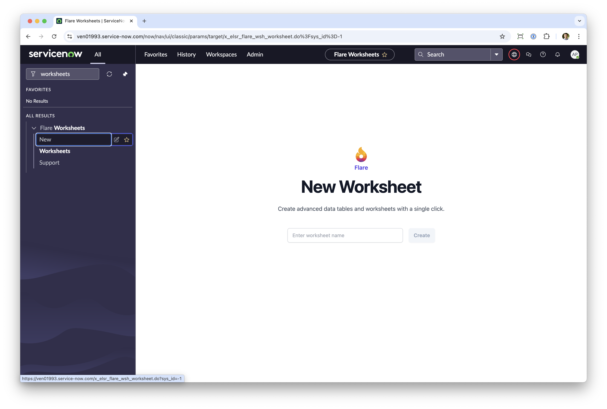
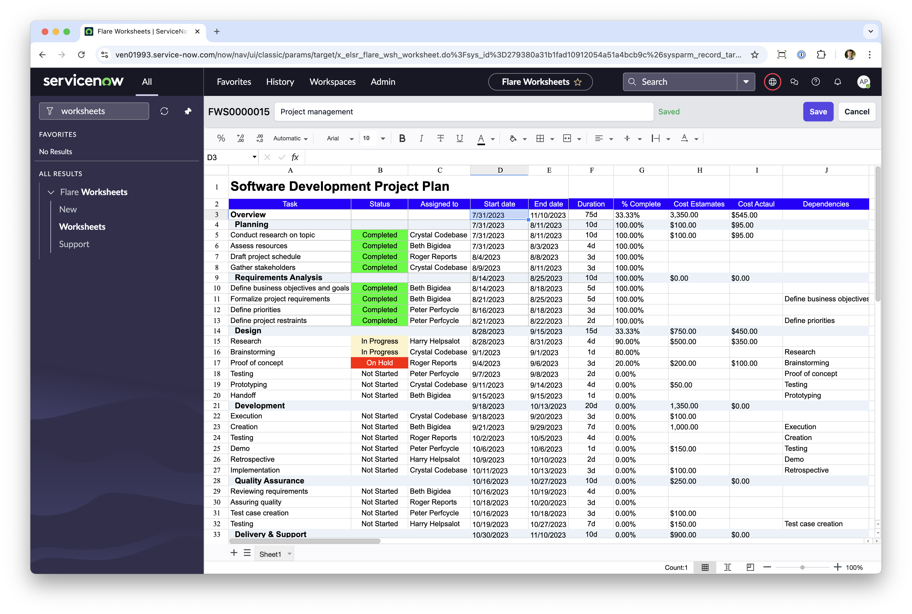
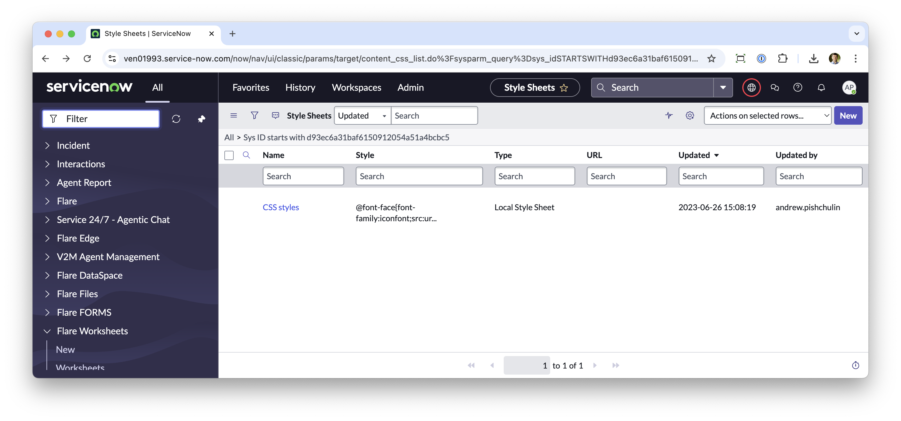

# Worksheets App

Excel-like app that allows you to create and edit worksheets in ServiceNow.

If you want to simply deploy the entire application to your ServiceNow instance, just download [the XML update set](./Flare%20Worksheets%202025.xml.zip) and import/preview/commit it in the target instance.

This repo is a web-app that represents the front-end of the ServiceNowapplication. It is built with React and Vite and uses the ServiceNow API to fetch and save data.

## How to run locally

> **Note:** You need to install XML update set first, so you have ServiceNow tables ready.

1. Clone the repository. 
2. Update `.env` with your ServiceNow user credentials VITE_REACT_APP_USER and VITE_REACT_APP_PASSWORD. **IMPORTANT:** Make sure your user has access to the Flare Worksheets table.
3. Run `npm install` to install the dependencies
4. Run `npm run dev` to start the development server

Then you have three options to open the app in the web browser:

1. Open `http://localhost:5173/?sys_id=-1` in your web browser to render a New Worksheet form
2. Open `http://localhost:5173/?sys_id=<sys_id>` in your web browser to render a specific Worksheet
3. Open `http://localhost:5173/?action=manual` in your web browser see "Support" page

## How to build and deploy the app

Run `npm run build` to build the production version of CSS and JS files. You'll get one CSS and one JS file in the `dist` folder.

Navigate to your ServiceNow instance and upload the CSS content to `content_css` table to the record wtih `SYS_ID=d93ec6a31baf6150912054a51a4bcbc5`:

JS file should be uploaded to UI Script `main.bundle.worksheets`.

